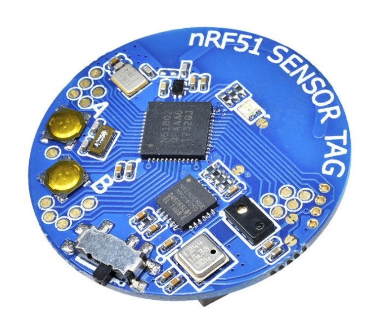

# Firmware for NRF51 sensor tag

https://www.aliexpress.com/item/32859423925.html

This firmware makes it possible to use the cheap nrf51 sensor tag as a high performance accelerometer and gyroscope over bluetooth. This firmware will output device roll and total accleration magnitude. Customization is possible in main.cpp. The DMP functions built into the MPU6050 were causing innexplicable crashes so I simply wrote a custom madjwick filter using raw values from the gyro and accelerometer. This also allows for a 30ms polling rate instead of the 200ms limitation on the DMP; this makes the device suitable for high performance applications. Can be used over serial bluetooth monitor, but this firmware is optimized for use with my android application https://github.com/sashalex007/nrf51_android_app. 

Prerequisites 
1. STlink v2, chinese clone will work
2. Keil uVision 5 (MDK)
3. Some jumper wires

NOTE: I am not providing a prebuilt firmware file for this repo because every DMP will have different xyz offsets, and its easy enough to build your own from source.

### Guide

1. Flash calibration firmware and run calibration to get XYZ offsets https://github.com/sashalex007/nrf51_MPU6050_calibrate
2. Import this project into your Keil Studio cloud (see guide 2 in the calibrate repo...do not use that URL)
3. Open main.cpp, and in the 'bool Init()' function enter your XYZ offset values (from step 1). 
4. Build the firmware
5. Flash the firmware with Keil uVision 5 (see guide 1 in the calibrate repo)

